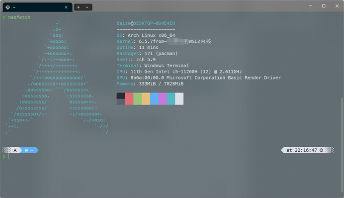

[中文](./readme-CN.md)|[English](./readme-US.md)

效果图



1.如果你像我一样，喜欢折腾你的 WSL2 ，这里是安装内核 6.X 的方法。

2.这是一个坏主意，可能会导致系统不稳定、数据损坏和其他问题。也可能会没事的，但不要怪我。

Arch linux的wsl2版本可以在微软商店下载，这是最简单的方法

注意：windows store中的arch linux并非官方发行，可能有各种问题

3.安装内核的依赖，对于 Debian 和 Ubuntu 来说，它是

```bash
sudo apt install build-essential flex bison dwarves libssl-dev libelf-dev
```

对于 Arch 来说，它是

```bash
sudo pacman -S base-devel flex bison pahole openssl libelf bc

```

ubuntu我并没有进行尝试，我使用的发行版为archlinux

4.下载你喜欢的 6.X 内核源代码、解压缩、cd(对于6.X的内核应该都可以使用)

```bash
wget https://cdn.kernel.org/pub/linux/kernel/v6.x/linux-6.5.7.tar.xz && tar xf linux-6.5.7.tar.xz && cd linux-6.5.7
```

5.下载Microsoft的 WSL2 内核配置并将其放在某个地方

```bash
wget https://raw.githubusercontent.com/microsoft/WSL2-Linux-Kernel/linux-msft-wsl-6.1.y/arch/x86/configs/config-wsl -O arch/x86/configs/config-wsl
```

6.使用所有线程编译内核

```bash
make KCONFIG_CONFIG=arch/x86/configs/config-wsl -j$(nproc)
```

7.我使用了自己的配置，如果你不知道自己在做什么，就什么也不要动

8.编译完成后，将内核映像复制到 Windows

```bash
cp arch/x86/boot/bzImage /mnt/C/opt

```

这是我的位置，你可以选位置

复制完将文件名改为kernel

9.关闭wsl虚拟机,打开PowerShell或cmd.exe然后执行 wsl --shutdown

10.编辑C:\Users\你的用户名\\.wslconfig

`[wsl2]`

`kernel=C:\\opt\\kernel(是双斜线，不要改)`

11.将C:\opt\kernel复制到C:\Windows\System32\lxss\tools

12..重启wsl虚拟机，输入uname-r就可以看到自己的内核了


DLC：如何开启systemd

sudo vim /etc/wsl.conf

`[boot]`

`systemd = true`
