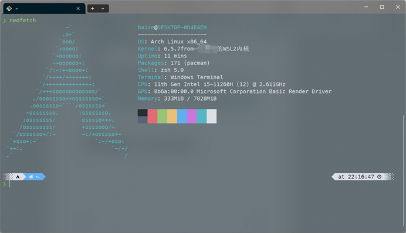

[中文](./readme-CN.md)|[English](./readme-US.md)

Effect drawing

1.If you're like me and like to fiddle with your WSL2, here's how to install kernel 6.X.

2.This is a bad idea and can lead to system instability, data corruption, and other issues. It might be okay. Please don't blame me

The wsl2 version of Arch linux can be downloaded from the Microsoft Store, which is the easiest way

Note: arch linux in the windows store is not an official release and may have various issues

3.A dependency on installing the kernel, for Debian and Ubuntu, it is

`sudo apt install build-essential flex bison dwarves libssl-dev libelf-dev`

For Arch, it is

`sudo pacman -S base-devel flex bison pahole openssl libelf bc`

ubuntu I didn't try it out, the distribution I use is archlinux

4.Download your favorite 6.X kernel source code, tar, cd(should work for 6.X kernel)

`wget https://cdn.kernel.org/pub/linux/kernel/v6.x/linux-6.5.7.tar.xz && tar xf linux-6.5.7.tar.xz && cd linux-6.5.7`

5.Download Microsoft's WSL2 kernel configuration and put it somewhere

`wget https://raw.githubusercontent.com/microsoft/WSL2-Linux-Kernel/linux-msft-wsl-6.1.y/arch/x86/configs/config-wsl -O arch/x86/configs/config-wsl`

6.Compile with all threads

`make KCONFIG_CONFIG=arch/x86/configs/config-wsl -j$(nproc)`

7.I used my own configuration, so if you don't know what you're doing, don't do anything

8.After compiling, copy the kernel image to Windows

`cp arch/x86/boot/bzImage /mnt/C/opt`

This is my spot. You can pick your spot

After copying, change the file name to kernel

9.Shut down the wsl virtual machine, open PowerShell or cmd and execute wsl --shutdown

10.Edit C:\Users\ you username\\.wslconfig

`[wsl2]`

`kernel=C:\\opt\\kernel(Double slash, don't change)`

11.Copy C:\opt\kernel to C:\Windows\System32\lxss\tools

12. Restart the wsl virtual machine and type uname-r to see your kernel

DLC:How do I enable systemd

sudo vim /etc/wsl.conf

`[boot]`

`systemd = true`
